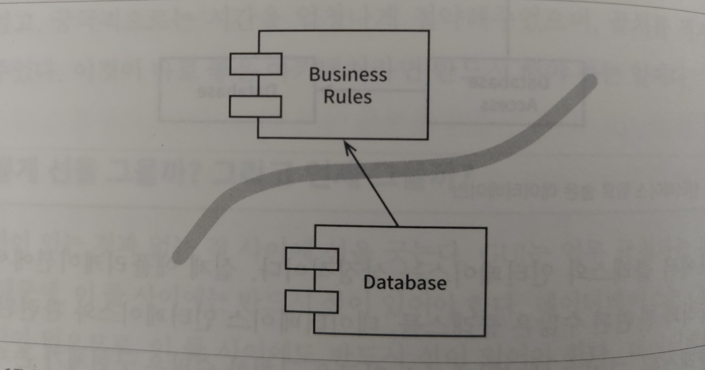

# Clean Architecture

참조 : 로버트 C. 마틴, 클린 아키텍처

## Component

자바의 경우 jar 파일로, 배포할 수 있는 가장 작은 단위다.

컴포넌트에도 객체지향의 SOLID 원칙과 비슷한 원칙이 적용된다.

### REP : Reuse / Release 등가 원칙

컴포넌트를 재사용 하려면 해당 컴포넌트가 어떤 역할을 하는지 자세히 알아야 한다. 

컴포넌트별로 릴리즈 절차를 통해 버전을 추적 관리하고, 변경 내용을 알 수 있어야 의사결정을 할 수 있다.

따라서 릴리즈 절차에는 공지와 릴리즈 문서가 포함되어야 한다. 

### CCP : 공통 폐쇄 원칙

동일한 시점에 같은 작업으로 변경되는 클래스는 같은 컴포넌트로, 다른 시점에 다른 작업으로 변경되는 클래스는 다른 컴포넌트로 분리한다.

SRP (단일책임원칙) 를 컴포넌트의 관점에서 적용한 원칙이다.

유지보수성이 재사용성보다 중요한데, 변경을 여러 컴포넌트에 분산시키기 보다는 단일 컴포넌트로 제한해야 한다.

### CRP : 공통 재사용 원칙

컴포넌트 내부에는 클래스들 사이에 수많은 의존성이 있다. 여기서 하나의 컴포넌트가 다른 컴포넌트를 사용하면, 두 컴포넌트 사이에 의존성이 생긴다.

사용하는 것이 다른 컴포넌트의 단 하나의 클래스라 할지라도, 다른 컴포넌트가 변경될 때마다 사용하는 컴포넌트도 변경해야 할 가능성이 높다.

강하게 결합되지 않은 클래스들을 동일한 컴포넌트에 위치시켜서는 안 된다.

## Architecture

아키텍처는 컴포넌트들의 집합이다. 아키텍트는 배치한 컴포넌트가 제 역할을 하는지 확인함과 동시에 생산성을 극대화할 수 있도록 하는 역할이다.

여기서 아키텍트의 중요한 역할은 아키텍처 안에 담긴 소프트웨어 시스템이 쉽게 개발, 배포, 운영, 유지보수 되도록 하는 것이다.

이를 위해서는 가능한 한 많은 선택지를, 가능한 한 오래 남겨두는 전략을 따라야 한다.

### 선택사항 열어 두기

좋은 아키텍처는 유스케이스를 중심으로 프레임워크나 도구, 환경에 구애받지 않고 유스케이스를 지원하는 구조로 설계되어 있다.

이를 위해서는 프레임워크, 데이터베이스, 웹 서버, 그 외 다른 개발 환경이나 도구에 대한 결정을 최대한 미룰 수 있도록 만든다.

그리고 결정을 했더라도 쉽게 번복할 수 있게 만든다. 

### 경계 선 긋기

유스케이스와 관련 없는 결정은 개발 효율을 떨어뜨린다. 위에서 말한 프레임워크, 데이터베이스, 웹 서버, 유틸리티 라이브러리 등이 해당된다.

좋은 아키텍처는 이러한 결정이 부수적이며, 결정을 연기할 수 있는 아키텍처다. 

데이터베이스를 예로 들면, 데이터베이스는 업무 규칙과 관련이 없으므로 둘 사이에 선이 있어야 한다.

데이터베이스는 업무 규칙을 의존한다.

업무 규칙에서 보면 Database Interface 는 업무 규칙에 따라 호출한 역할만 수행할 수 있으면 된다. 

여기서 Database Interface 에서 수행되는 역할은 특정 Database 가 아니어도 얼마든지 수행할 수 있다.

Gui 도 마찬가지다.

BusinessRules 는 입력에 따른 Gui 만 표시할 수 있으면 된다. 따라서 이 둘 역시 경계선에 의해 분할된다.

GUI 는 업무 규칙을 의존한다.

### 플러그인 아키텍처

핵심적인 업무 규칙은 다양한 컴포넌트로부터 분리되어 있고, 독립적이다.

여기서 업무 규칙의 플러그인이 되는 것은 업무 규칙을 수행할 수 있는 어떠한 컴포넌트가 와도 무관하다.

다양한 종류의 GUI 그리고 마찬가지로 다양한 종류의 DB 에서 아키텍트가 적당하다고 판단한 것을 선택하여 연결한다.

## 클린 아키텍처

안으로 들어갈수록 고수준의 소프트웨어가 된다.

바깥은 메커니즘, 안쪽은 정책이다.

소스 코드의 의존성은 반드시 안쪽으로, 고수준의 정책을 향해야 한다.

내부의 원에서는 외부에 대한 것을 알지 못한다. 

특히 프레임워크가 생성한 데이터 형식이라면 여기에 의존해서는 안 된다.

### 엔티티

엔티티는 핵심 업무 규칙을 캡슐화한다.

외부의 무언가가 변경되어도 엔티티가 변경될 가능성은 지극히 낮다. 

운영 관점에서 특정 애플리케이션에 무언가가 변경이 필요하더라도 엔티티 계층에는 절대로 영향을 주어서는 안 된다.

### 유스케이스

이 계층의 소프트웨어는 애플리케애션에 특화된 업무 규칙을 포함한다. 

시스템의 모든 유스케이스를 캡슐화하고 구현한다.

이 계층의 변경이 엔티티에 영향을 주어서는 안 된다. 또한 외부의 변경이 이 계층에 영향을 줘서도 안 된다.

유스케이스의 세부사항이 변경되면, 이 계층의 코드 일부가 영향을 받게 된다.

### 인터페이스 어댑터

유스케이스와 엔티티에서 사용되는 인터페이스 형식에서 데이터베이스나 웹 같은 외부 에이전시에서 사용되는 형식으로 변환한다.

여기서 SQL 기반의 데이터베이스를 사용한다면 데이터베이스의 영속에 사용되는 SQL 은 이 계층을 벗어나서는 안 된다.

이 계층에서도 데이터베이스를 담당하는 부분으로 제한해야 한다.

계층간의 연결에 데이터 형식의 변환이 필요하기 때문에 외부의 형식에서 내부로 변환하는 또 다른 어댑터가 필요하다.

### 프레임워크와 드라이버

바깥쪽 계층은 프레임워크나 도구들로 구성된다. 

이 계층에서는 안쪽 원과 통신하기 위한 접합 코드가 필요하다.

바깥쪽 계층의 구성 요소들은 세부사항이다. 이러한 세부사항들을 외부에 위치시켜서 변경에 의한 피해를 최소화한다.

### 경계 횡단

제어흐름을 보면 컨트롤러에서 시작하여 유스케이스를 지나 프레젠터에서 실행된다.

의존성과 제어흐름이 반대여야 하는 경우, 의존성 역전 원칙을 사용하여 해결한다.

여기서는 유스케이스가 내부 원의 인터페이스를 호출하도록 하고, 외부 원의 프레젠터가 이 인터페이스를 구현하도록 만든다.

이때 경계를 횡단하는 데이터는 내부 원에서 사용되도록 변환된 데이터 형식이어야 한다. 

그대로 전달된다면 내부 원에서 외부 원에 대해서 알게 되기 때문에 의존성 규칙을 위배하게 된다.

### 웹 기반 시스템 시나리오

 